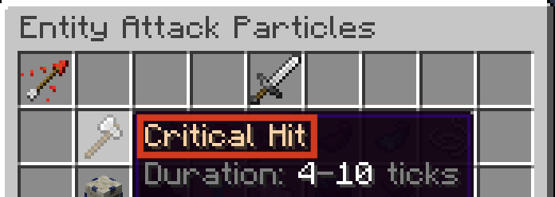

## Syntax
Particles are created using the `par` constructor. Like all constructors in Terracotta, the values passed into the constructor are [Expressions](../language_features/expressions.md) and can take full advantage of their features. 

```tc
par(particle: str, ...fields)
```

`particle` is the name of the potion that appears at the top of a particle effect's button, NOT its minecraft id.

```tc
par("Critical Hit")
```

{width="500"}

## Fields
Data about the behavior of a particle like amount, color, spread, etc. are provided via named arguments. All fields are optional and will use default values if ommitted.

```tc 
par("Dust",
    amount = 10,
    spreadHoriz = 1, spreadVert = 1,
    color = "#ff0000",
    colorVariation = 0
)
```

The following are all the possible data fields. Amount and spread can always be specified no matter what, the rest may or may not be available depending on the type of particle.

### Amount
A `num` specifying how many particles to spawn. 

Defaults to `1` if omitted.

```tc title="Example"
amount = 20
```

### Spread
Spread is split up into two `num` fields: `spreadHoriz` and `spreadVert`.

Both default to `0` if omitted.

```tc title="Example"
spreadHoriz = 0,
spreadVert = 1
```

### Motion
A `vec` specifying the velocity of the particles. Longer length vectors will result in faster movement. 

Defaults to `vec(1, 0, 0)` if omitted.

```tc title="Example"
motion = vec(0, 5, 0) // particle shoots straight up
```

### Motion Variation
A `num` (0-100) specifying how much to randomize the motion of the particles. Any digits after the decimal place will be removed by DiamondFire. `0` will mean the exact value of `motion` is always used, `100` will mean the direction is completely random and the speed will be anywhere between 100% and 0% of the length of `motion`. 

Defaults to `100` if omitted.

```tc title="Example"
motionVariation = 50 // 50%
```

### Color
A `str` specifying the color of the particles as a hexadecimal RGB color. The color must contain exactly 6 hexadecimal digits and must start with a hashtag (`#`).

Defaults to `"#ff0000"` if omitted.

```tc title="Example"
color = "#8000ff"
```

### Color Variation
A `num` (0-100) specifying how much to randomize the color of the particles. Any digits after the decimal place will be removed by DiamondFire. `0` will mean the exact value of `color` is always used, `100` will mean the color is completely random.

Defaults to `0` if omitted.

```tc title="Example"
opacity = 50 // 50%
```

### Fade Color
A `str` specifying the color to transition to in particles like Fade Dust. Uses the same syntax as [Color](particle.md#color).

Defaults to `"#000000"` if omitted.

```tc title="Example"
fadeColor = "#ffaaff"
```

### Material
A `str` specifying the material id of the particles. Uses item ids, NOT names.

Defaults to `"oak_log"` if omitted.

```tc title="Example"
material = "diamond_block"
```

### Size
A `num` specifying the size of the particles.

Defaults to `1` if omitted.

```tc title="Example"
size = 2
```

### Size Variation
A `num` (0-100) specifying how much to randomize the size of the particles. Any digits after the decimal place will be removed by DiamondFire. `0` will mean the exact value of `size` is always used, `100` will mean the size could be anywhere between 3*`size` and 0.

Defaults to `0` if omitted.

```tc title="Example"
sizeVariation = 50 // 50%
```

### Roll
A `num` specifying the rotation of the particles.

!!! info "`roll` uses RADIANS as a unit, not degrees. To convert from degrees to radians, use [this](https://www.google.com/search?q=degrees+to+radians)."

Defaults to `0` if omitted.


```tc title="Example"
roll = 3.14159 // 180 degrees
```

### Opacity
A `num` (0-100) specifying the opacity of the particles. Any digits after the decimal place will be removed by DiamondFire. `0` is completely transparent, `100` is completely visible. 

Minecraft will round values of 10 and below down to 0 when displaying, meaning the most transparent a particle can be while still being visible will have an opacity of 11.

Defaults to `100` if omitted.

```tc title="Example"
opacity = 50 // 50%
```

### Power
A `num` specifying the power of the particles.

Defaults to `1` if omitted.

```tc title="Example"
power = 0.5
```

### Duration
A `num` specifying the duration of the particles, specified in ticks.

Defaults to `20` if omitted.

```tc title="Example"
power = 40 // 2 seconds
```

#### `txt` + `par`: `txt`
Stringifies the Particle then adds it onto the Styled Text.
```tc
s"Selected trail: " + par("Flame") = s"Selected Trail: Flame[1][0.0,0.0][1.0,0.0,0.0|100%]"

par("Bubble") + s" is a particle." = s"Bubble[1][0.0,0.0][1.0,0.0,0.0|100%] is a particle."
```