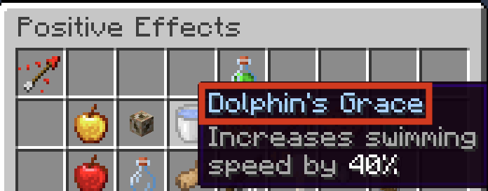

## Syntax
Potions are created using the `pot` constructor. Like all constructors in Terracotta, the values passed into the constructor are [Expressions](../language_features/expressions.md) and can take full advantage of their features.

```tc
pot(potion: str, amplifier?: num, duration?: num)
```

`amplifier` is 1-based: An amplifier of 1 means a potion effect level of I. `amplifier` is optional and will default to `1` if omitted.

`duration` is specified in ticks, meaning a duration of `20` is equal to one second. `duration` is optional and will default to infinite if omitted.

`potion` is the name of the potion that appears at the top of a potion effect's button, NOT its minecraft id.

```tc
pot("Dolphin's Grace", 1, 300)
```

{width="500"}


## Operations

#### `txt` + `pot`: `txt`
Stringifies the Potion then adds it onto the Styled Text.
```tc
s"Your curse: " + pot("Weakness", 2, 10*20) = s"Your curse: Weakness 2 - 0:10"

pot("Wither", 5, 1200) + s" is very painful." = s"Wither 5 - 1:00 is very painful."
```