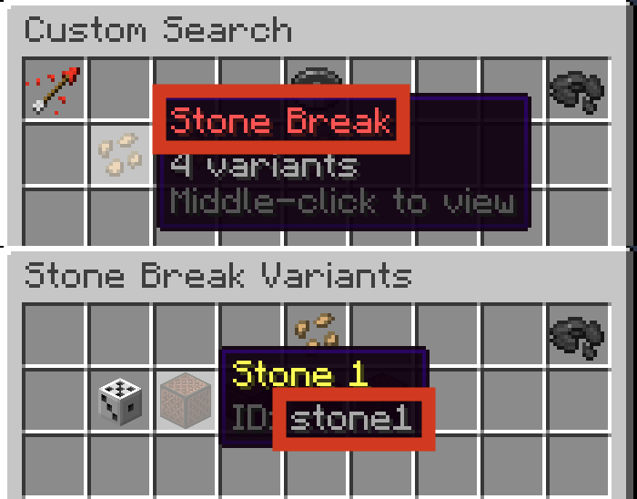

## Syntax
Sounds are created using the `snd` and `csnd` constructors. Like all constructors in Terracotta, the values passed into the constructor are [Expressions](../language_features/expressions.md) and can take full advantage of their features.

```tc
snd(sound: str, volume?: num, pitch?: num | str, variant?: str)

csnd(sound: str, volume?: num, pitch?: num | str)
```

`pitch` can be a number from 0.5-2, or it can be a note name. `pitch` is optional and defaults to `1` if omitted.
??? info "Click to view all valid note names and their pitches"
    | Note | Equivalent Pitch |
    |-|-|
    | `"F#0"` | `0.5` |
    | `"Gb0"` | `0.5` |
    | `"G0"` |  `0.529732` |
    | `"G#0"` | `0.561231` |
    | `"Ab1"` | `0.561231` |
    | `"A1"` |  `0.594604` |
    | `"A1"` |  `0.594604` |
    | `"A#1"` | `0.629961` |
    | `"Bb1"` | `0.629961` |
    | `"C1"` |  `0.707107` |
    | `"C#1"` | `0.749154` |
    | `"Db1"` | `0.749154` |
    | `"D1"` |  `0.793701` |
    | `"D#1"` | `0.840896` |
    | `"Eb1"` | `0.840896` |
    | `"E1"` |  `0.890899` |
    | `"F1"` |  `0.943874` |
    | `"F#1"` | `1.0` |
    | `"Gb1"` | `1.0` |
    | `"G1"` |  `1.059463` |
    | `"G#1"` | `1.122462` |
    | `"Ab2"` | `1.122462` |
    | `"A2"` |  `1.189207` |
    | `"A#2"` | `1.259921` |
    | `"Bb2"` | `1.259921` |
    | `"B2"` |  `1.33484` |
    | `"C2"` |  `1.414214` |
    | `"C#2"` | `1.498307` |
    | `"Db2"` | `1.498307` |
    | `"D2"` |  `1.587401` |
    | `"D#2"` | `1.681793` |
    | `"Eb2"` | `1.681793` |
    | `"Eb2"` | `1.681793` |
    | `"E2"` |  `1.781797` |
    | `"F2"` |  `1.887749` |
    | `"F#2"` | `2.0` |
    | `"Gb2"` | `2.0` |


`volume` is optional and defaults to `2` if omitted.

To play a random variant every time, omit the `variant` argument.

When using the `snd` constructor, `sound` is the name that appears at the top of a sound's button, and `variant` is the ID that appears in the button's lore.
```tc
snd("Stone Break", 1, 1, "stone1");
```
{ width="500" }

When using the `csnd` constructor, `sound` is the minecraft id of the sound that would be used in a /playsound command. This allows the use of custom sounds provided by a plot resource pack.

```tc
// Custom sounds can be played.
csnd("item.custom_magic_wand.use")

// Vanilla sounds can also be played with their Minecraft ids.
// Using csnd for vanilla sounds is not recommended as variants cannot
// be specified and a sound's Minecraft id may change between updates.
csnd("block.stone.break", 1, 0.8)
```

## Operations

### + (Addition)
#### `txt` + `snd`: `txt`
Stringifies the Sound then adds it onto the Styled Text.
```tc
s"Cool sound: " + snd("Stone Break", 1, 1, "stone1") = s"Cool sound: Stone Break,stone1[1.0][1.0]"

snd("Stone Break", 1, 1, "stone1") + s" is a cool sound." = s"Stone Break,stone1[1.0][1.0] is a cool sound."
```