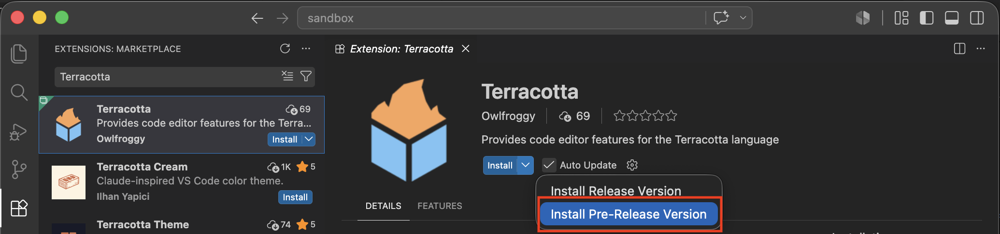
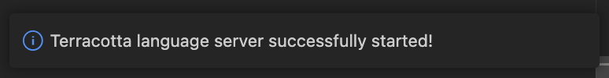
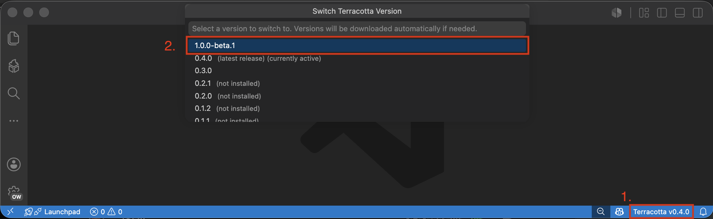
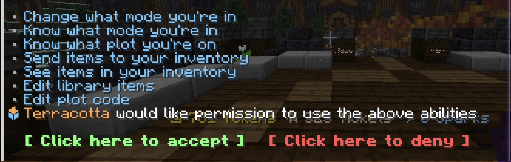

# Installation Guide

!!! info "Other editors beside VSCode aren't supported at the moment, though that will probably change in the future."

If you get stuck at any point, ask for help on the [the Discord server](https://discord.gg/at9uBFXPxy).

## 1. Install the VSCode extension

[Install VSCode](https://code.visualstudio.com/download) if you haven't already. It will be the editor you use to write Terracotta code.

The extension can be downloaded by searching 'Terracotta' in the VSCode extensions tab. Make sure to install the pre-release version by using the dropdown next to the install button.

Once downloaded, it should set itself up automatically. If you see this message in the bottom right, that means it has successfully installed itself:

{width="500"}

For more information on everything the extension provides, see [Extension Features](). 

## 2. Switch to the beta version of Terracotta
Because this version is a beta, you will not be prompted to automatically update.
To install it, click the `Terracotta vX.X.X` text in the bottom right corner of VSCode to open the version switcher. Select the version **at the very top of the list** to download and switch to it.

!!! bug
    Sometimes the extension fails to start properly.
    If you don't see the version text, try opening a folder and creating a file with the `.tc` extension.

## 3. Set up the Terracotta Client mod
<!-- Install the [Terracotta Client](https://modrinth.com/mod/codeclient) mod manually or using your launcher of choice.  -->
The mod will be available on Modrinth as soon as it's done getting verified (the link will be posted here when that is done). 

In the mean time, it can be downloaded [directly from GitHub](https://github.com/Owlfroggy/terracotta-client-mod/releases/download/v1.0.1/terracotta-client-1.0.1.jar). ([Source Code](https://github.com/Owlfroggy/terracotta-client-mod))

Make sure you are using Fabric on version **26.2**.

## That's it!

If the mod has been correctly installed, you should be prompted to whitelist VSCode when you join DiamondFire.

If you got this message, you're good to go! Next, [Compile your first plot](plot_setup.md).