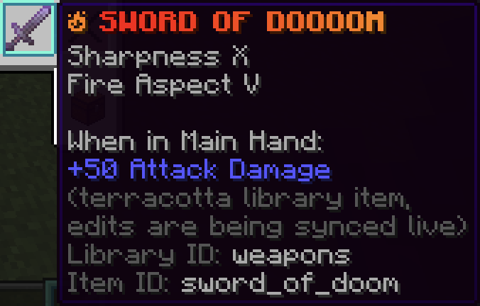

## Scripts
Terracotta scripts use the extension `.tc` and contain code that is compiled to DiamondFire templates.

!!! tip "Unlike old Terracotta, a single script can now contain multiple events/functions/processes."

```tc title="Example Script"
function send_centered_message(message: txt) {
    allPlayers.sendMessage(message, align="Centered");
}

playerevent join {
    send_centered_message(s"%default <green>has joined!");
}
```
## Semantics

Terracotta is a non-whitespace-significant language that relies on semicolons to separate instructions. This means complex lines can be arbitrarily split up however you see fit because it's ultimately the semicolons that differentiate between them.

```tc title="Both of these statements are valid."
default.displayParticleEffect(par("Block",amount=10, material="diamond_block"), default.location);
default.displayParticleEffect(
    par(
        "Block",
        amount=10,
        material="diamond_block"
    ),
    default.location
);
```

Anything that involves sectioning off chunks of code (like if statements or loops) does so with curly braces.
```tc title="Example"
if (player.hasPlotPermission(permission="Owner")) {
    player.sendMessage("You are the owner!");
}
```
```tc title="Example"
while (default.attackCooldownTicks > 0) {
    player.givePotionEffect(pot("Slowness"));
    wait;
}
default.clearPotionEffects();
```

## Expressions
Nearly every place in Terracotta that accepts a value accepts an expression. This means equations and even other action calls can be inlined, avoiding the need to use temporary variables.

```tc title="Example"
function colored_particle_trail(hue: num) {
    allPlayers.displayParticleEffect(
        par(
            var.setToRandom("Entity Effect","Dust"),
            amount = num.random(1,5),
            color  = var.setToHSBColor(hue * 2,100,100)
        ),
        default.location.shiftAllAxes(0,0.1,0)
    );
}
```
More detailed information on Expressions can be found [here](../language_features/expressions.md).

## Types
Terracotta's type system allows variables to keep track of what kinds of values they should be storing. Not only is this critical for using variables in expressions, but it also allows you to have a level of type-safety that normally doesn't exist in DiamondFire.

Some level of type inference does exist, but it's recommended to explicitly type variables when they're declared.

```tc
line test: num = 5 * 2;

// test's type will be inferred as 'num' if a type isn't provided
line test = 5 * 2;
```

Generic types are also supported. Type inference will NOT infer the subtypes of lists and dictionaries, so explicit typing is even more important here.
```tc
line numbers: list[num] = [5, 10, 15];

// if you didn't declare the type as list[num], you may encounter buggy behavior
line numbers = [5, 10, 15]; // numbers is typed as list[any] here
```

As long as you declare your variable's types you shouldn't run into any type issues, but if you ever need to tell the compiler to treat a variable a certain way you can use the `as` keyword
```tc
line power; // will be typed as 'any'

player.launchUp(power as num); // this WOULD throw an error without the typecast
```

More detailed information on the type system can be found [here](../language_features/types.md).

## Item Libraries
Item Libraries are Terracotta's solution for representing items with complex data. 
Library items can be imported from your Minecraft inventory, and can later be edited in-game and will be synced back to your project files live.

!!! info inline ""
    {width="98%"}
Saved items with complex nbt can be easily referenced in code with the `litem()` function.
```tc
default.giveItems(
    // no inlined nbt!
    litem("weapons", "sword_of_doom")
);
```


More detailed information on Item Libraries can be found [here](../language_features/item_libraries.md).

## Comments
Single-line comments start with `//`.
```tc
// Sends a message to the player
// TODO: Add color codes
player.sendMessage("Hello world!"); // End-of-line comment

// Code can be commented out to disable it:
//default.playSound(snd("Pling"));
```

Block comments are surrounded with `/*` and `*/`.
```tc
/* 
 * Multi!
 * Line!
 * Comment!!!
 */

/*
the stars on the side
are also not necessary
*/

/* it can also be all on one line */
```

Adding an extra star to the start of a block comment (`/**`) turns it into a documentation comment.
```tc
/**
 * This text will show up in test's autocomplete entry!
 */
function test(
    /** This text will show up when you're calling test! */
    wow: str
) {
    print(wow);
}
```

Documentation comments can be applied to:

- Functions
- Processes
- Parameters
- Variable Declarations
- Dictionary keys (in variable declarations)

####
Next: Read more on [Expressions](../language_features/expressions.md) or [Types](../language_features/types.md), learn about [Item Libraries](), see how [Actions](../code_blocks/action.md) and [Variables](../code_items/variable.md) work, or just start messing around and reference these docs as needed!