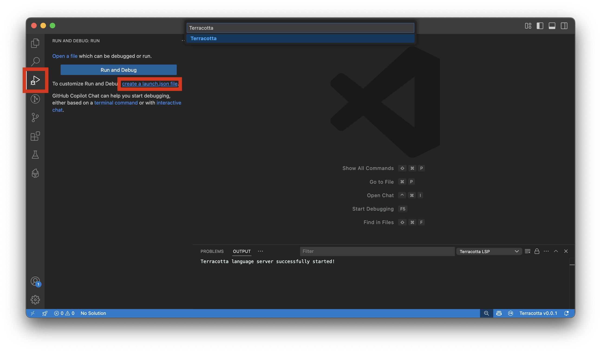
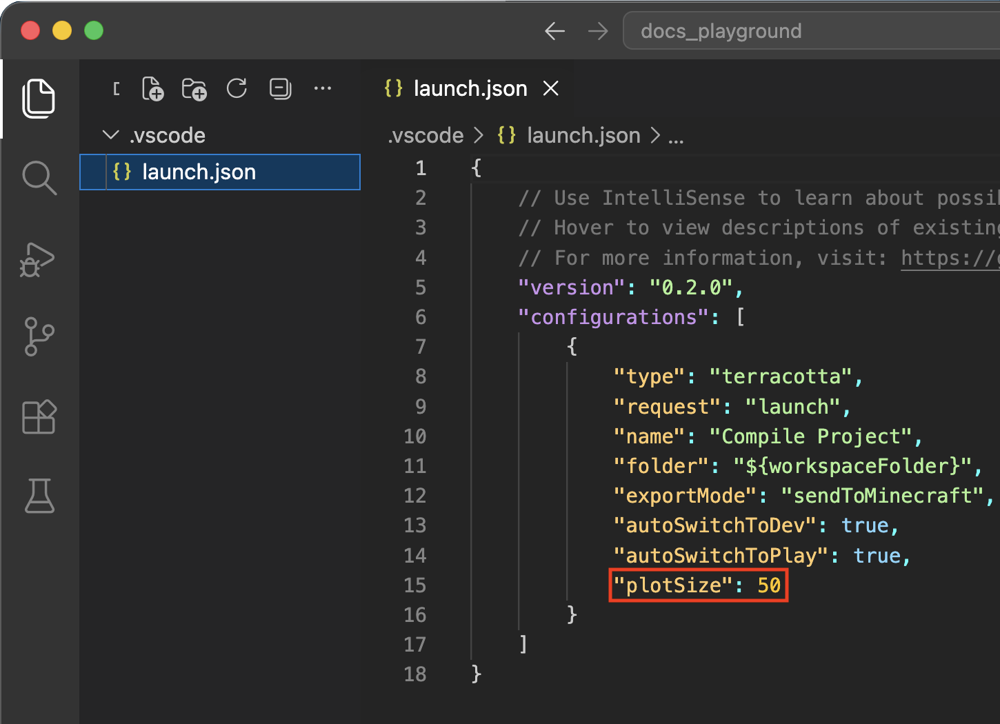

# Plot Setup

If you haven't already installed the VSCode extension and the Terracotta Client mod, see [Installation](installation_guide.md).

!!! danger "Don't delete your code!"
    Always make sure to start with an empty plot. Never run Terracotta on plots made using normal DiamondFire coding because there is no way to recover code Terracotta may overwrite.

## Creating a Project
1. Choose a plot on DiamondFire to compile to and join it.
2. Create a folder to hold all your plot's code and open it in VSCode. 
3. From the Run and Debug menu, click `create a launch.json file` and select `Terracotta` from the list of langauges. 

4. In the newly created `launch.json` file, make sure to set `plotSize` appropriately for the plot you will be compiling to.

!!! info inline end ""
    Plot Type | Plot Size
    - | -
    Basic | `50`
    Large | `100`
    Massive | `300`
    Mega | `300`
    World | `300`
{width="63%"}


??? info "All `launch.json` parameters and what they do"
    - `folder`: The folder to compile. This should almost always be set to `"${workspaceFolder}"`.
    - `exportMode`: Can be either `"sendToMinecraft"` or `"saveToFiles"`.
        - `"sendToMinecraft"`: When running, automatically place compiled templates via Terracotta Client.
        - `"saveToFiles"`: (CURRENTLY UNIMPLEMENTED!) When running, save all compiled templates to files.
    - `autoSwitchToDev`: If in play or build mode upon compiling, automatically enter dev mode. If left disabled, trying to compile while in build or play mode will fail. Only applies if `exportMode` is `"sendToMinecraft"`.
    - `autoSwitchToPlay`: Automatically enter play mode after all compiled templates have been placed.
    - `plotSize`: Used by the codeline splitter to know what length templates should be limited to. If you want to "disable" the codeline splitter, just set this to a very high number.
    - `plotIds`: An array of plot ids. If present, an error will be thrown when trying to compile to a plot that's not in this list.
        ```json title="Example"
        "plotIds": [12345, 347583]
        ```
    - `plotOverrides`: Overrides compilation settings when compiling to specific plots. The following properties can be overridden: `plotSize`, `autoSwitchToDev`, and `autoSwitchToPlay`.
        ```json title="Example"
        "plotOverrides": {
            "plot id goes here": {
                "plotSize": 100,
                "autoSwitchToPlay": false,
            }
        }
        ```

## Compiling a Project
Terracotta script files have the extension `.tc`. Create a script in your project folder to test with:

``` tc title="test.tc"
playerevent join {
    player.sendMessage("Hello world!");
}

```

If you can see `✔︎ Connected to MC` in the bottom right of VSCode, you are ready to compile.

Press `f5` or click the green play symbol at the top of Run and Debug to compile your plot.

Next: [Get an overview of how Terracotta works](./language_overview.md)